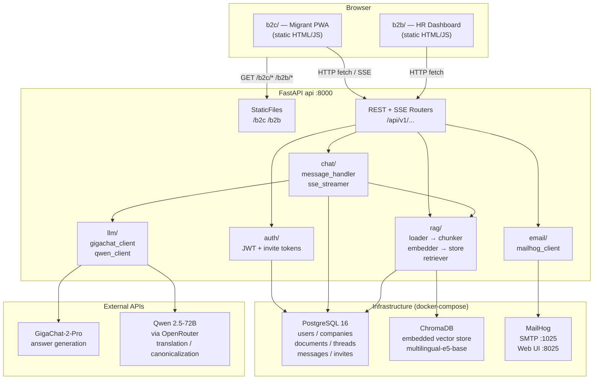
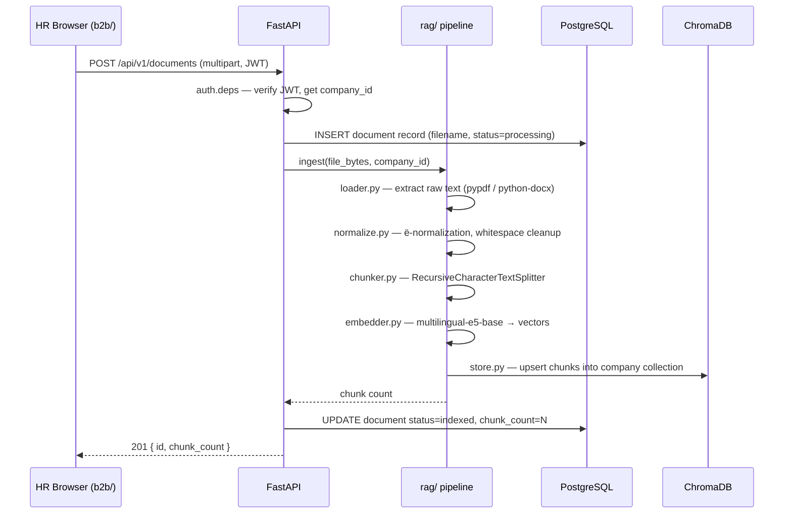
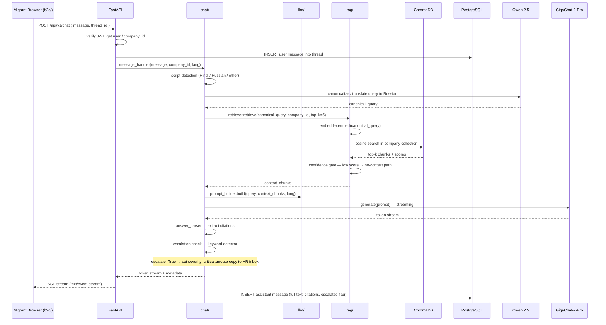

# AdaptaAI — Architecture

This document describes the components, request flows, data model, and deployment topology of AdaptaAI.

---

## Components



---

## Request Flow 1 — HR Uploads a Document

An employer uploads a PDF or DOCX through the HR dashboard (`/api/v1/documents`).



---

## Request Flow 2 — Migrant Asks a Question

A migrant types a question in the PWA chat. The answer streams back via Server-Sent Events.



---

## Data Model Summary

| Table | Key columns | Notes |
|---|---|---|
| `users` | id, email, role (hr/migrant), company_id, hashed_password | invite-based registration |
| `companies` | id, name, logo_url | created by HR on signup |
| `invites` | id, token_hash, company_id, expires_at, used_at | 7-day TTL signed tokens |
| `documents` | id, company_id, filename, status, chunk_count | status: pending/indexed/error |
| `chat_threads` | id, user_id, company_id, created_at | one thread per conversation |
| `chat_messages` | id, thread_id, role, content, citations, escalated, severity | full message history |
| `journey_steps` | id, user_id, step_key, completed_at | onboarding progress tracking |

ChromaDB stores vector chunks in a **per-company collection** (`company_{id}`). Each chunk document stores `source_doc_id`, `page`, and `chunk_index` as metadata for citation reconstruction.

---

## Deployment Topology

The full stack runs via a single `docker-compose.yml` in `infra/`. Three services:

```
┌─────────────────────────────────────────────────────┐
│  docker-compose  (infra/)                           │
│                                                     │
│  ┌──────────────────────────────────────────────┐   │
│  │  api  (adapta-api image, port 8000)          │   │
│  │  • builds from backend/Dockerfile            │   │
│  │  • mounts b2c/, b2b/ as read-only volumes    │   │
│  │  • mounts backend/app for hot-reload         │   │
│  │  • api_data volume → ChromaDB + uploads      │   │
│  │  • reads infra/.env                          │   │
│  └──────────────────┬──────────────────────────-┘   │
│                     │                               │
│  ┌──────────────────▼──────┐  ┌──────────────────┐  │
│  │  postgres :5432         │  │  mailhog          │  │
│  │  postgres:16-alpine     │  │  :1025 (SMTP)     │  │
│  │  postgres_data volume   │  │  :8025 (Web UI)   │  │
│  └─────────────────────────┘  └──────────────────┘  │
└─────────────────────────────────────────────────────┘
```

The `api` service depends on `postgres` (health-checked) and `mailhog`. On startup, `alembic upgrade head` runs automatically. ChromaDB runs **embedded** inside the `api` process — no separate service is needed.

For production deployment, replace MailHog with a real SMTP server (`SMTP_HOST`, `SMTP_PORT`, etc. in `.env`) and consider adding a reverse proxy (nginx/Caddy) in front of the `api` container.
